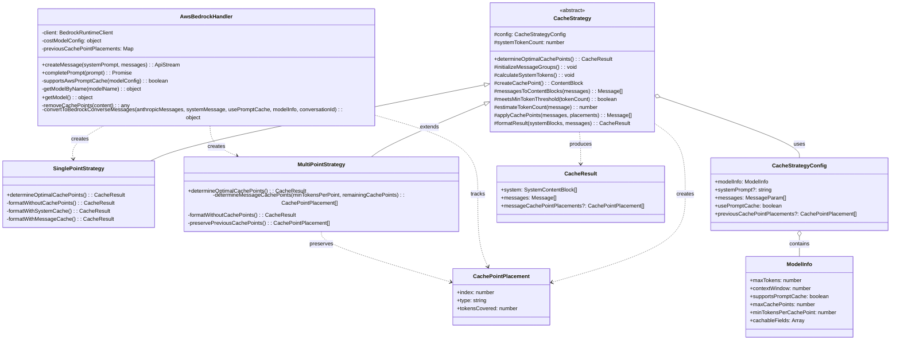
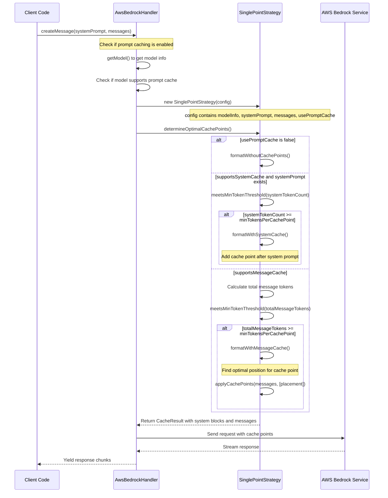
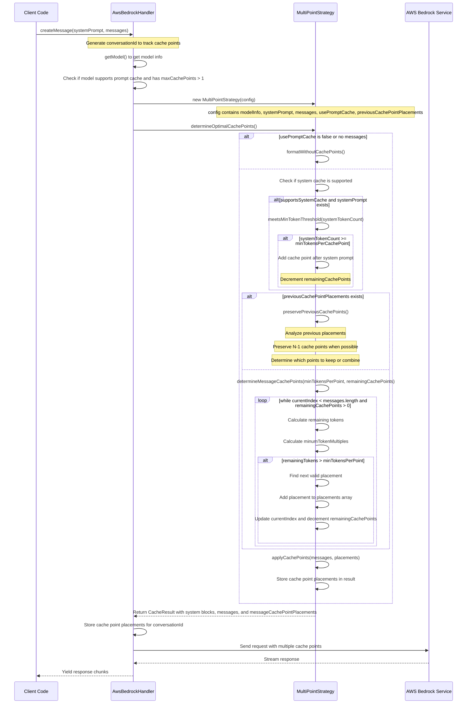

# Cache Strategy Documentation

This document provides an overview of the cache strategy implementation for AWS Bedrock in the Roo-Code project, including class relationships and sequence diagrams.

## Implementation Note

The cache strategy implementation has been optimized to better utilize available cache points. The key optimization is in the calculation of `minimTokensForRemainingCachePoints`:

```typescript
// Add 1 to remainingCachePoints to lower the minumTokenMultiples value,
// which results in cache points being placed earlier and more frequently.
// This ensures better utilization of available cache points throughout the conversation.
let minimTokensForRemainingCachePoints = minTokensPerPoint * (remainingCachePoints + 1)
```

By multiplying `minTokensPerPoint` by `(remainingCachePoints + 1)` instead of just `remainingCachePoints`, we lower the `minumTokenMultiples` value. This results in cache points being placed earlier and more frequently throughout the conversation, ensuring better utilization of available cache points.

The examples in this document reflect this optimized implementation.

## Class Relationship Diagram



## Sequence Diagram: Single-Point Strategy

This diagram illustrates the process flow when using the SinglePointStrategy for cache point placement.



## Sequence Diagram: Multi-Point Strategy

This diagram illustrates the process flow when using the MultiPointStrategy with multiple cache points in messages.



## Key Concepts

### Cache Strategy

The cache strategy system is designed to optimize the placement of cache points in AWS Bedrock API requests. Cache points allow the service to reuse previously processed parts of the prompt, reducing token usage and improving response times.

### Strategy Selection

- **SinglePointStrategy**: Used when the model supports only one cache point or when the maximum cache points is set to 1. It places the cache point either after the system prompt or at an optimal position in the message history.

- **MultiPointStrategy**: Used when the model supports multiple cache points. It distributes cache points throughout the conversation to maximize caching efficiency.

### Cache Point Placement Logic

- **System Prompt Caching**: If the system prompt is large enough (exceeds minTokensPerCachePoint), a cache point is placed after it.

- **Message Caching**:
    - In SinglePointStrategy, a single cache point is placed at a position where enough tokens have accumulated.
    - In MultiPointStrategy, multiple cache points are distributed based on token thresholds and message boundaries.

### Integration with AWS Bedrock

The AwsBedrockHandler class integrates with the cache strategies by:

1. Determining if the model supports prompt caching
2. Creating the appropriate strategy based on model capabilities
3. Applying the strategy to format messages with optimal cache points
4. Sending the formatted request to AWS Bedrock
5. Processing and returning the response

## Usage Considerations

- Cache points are only effective if the same content is reused across multiple requests
- The minimum token threshold ensures cache points are only placed where they provide meaningful benefits
- System prompt caching is prioritized when available, as it's typically static across requests
- Message caching is more complex and depends on conversation structure and token distribution

## Examples: Multi-Point Strategy Cache Point Placement

### Example 1: Initial Cache Point Placement

In this example, we'll demonstrate how the `determineMessageCachePoints` method places cache points in a new conversation.

**Input Configuration:**

```javascript
const config = {
	modelInfo: {
		maxTokens: 4096,
		contextWindow: 200000,
		supportsPromptCache: true,
		maxCachePoints: 3,
		minTokensPerCachePoint: 100,
		cachableFields: ["system", "messages"],
	},
	systemPrompt: "You are a helpful assistant.", // ~10 tokens
	messages: [
		{ role: "user", content: "Tell me about machine learning." }, // ~50 tokens
		{ role: "assistant", content: "Machine learning is a field of study..." }, // ~150 tokens
		{ role: "user", content: "What about deep learning?" }, // ~40 tokens
		{ role: "assistant", content: "Deep learning is a subset of machine learning..." }, // ~160 tokens
	],
	usePromptCache: true,
}
```

**Execution Process:**

1. First, the system prompt is evaluated for caching (10 tokens < minTokensPerCachePoint of 100), so no cache point is used there.
2. The `determineMessageCachePoints` method is called with `minTokensPerPoint = 100` and `remainingCachePoints = 3`.
3. The method calculates that there are 400 tokens total in the messages.
4. It calculates `minimTokensForRemainingCachePoints = minTokensPerPoint * (remainingCachePoints + 1) = 100 * 4 = 400`.
5. It then calculates `minumTokenMultiples = Math.ceil(remainingTokens / minimTokensForRemainingCachePoints) = Math.ceil(400 / 400) = 1`.
    - This means the algorithm needs to find 1 instance where accumulated tokens exceed the minimum threshold before placing a cache point.
6. For each potential placement:
    - It accumulates tokens as it processes messages
    - When it encounters a user message where accumulated tokens exceed the minimum threshold (100), it increments a counter
    - When this counter reaches the calculated multiple (1), it places a cache point and resets the process for the next cache point
    - It only places cachePoints after user messages, never after assistant messages

**Output Cache Point Placements:**

```javascript
;[
	{
		index: 2, // After the second user message (What about deep learning?)
		type: "message",
		tokensCovered: 240, // ~240 tokens covered (first 3 messages)
	},
]
```

**Resulting Message Structure:**

```
[User]: Tell me about machine learning.
[Assistant]: Machine learning is a field of study...
[User]: What about deep learning?
[CACHE POINT]
[Assistant]: Deep learning is a subset of machine learning...
```

**Note**: With `minumTokenMultiples = 1`, the algorithm places a cache point after the second user message because the accumulated tokens (240) exceed the minimum threshold (100).

### Example 2: Adding One Exchange with Cache Point Preservation

Now, let's see what happens when we add one more exchange (user-assistant pair) to the conversation and use the cache point preservation logic:

**Updated Input Configuration with Previous Cache Points:**

```javascript
const config = {
	// Same modelInfo and systemPrompt as before
	messages: [
		// Previous 4 messages...
		{ role: "user", content: "How do neural networks work?" }, // ~50 tokens
		{ role: "assistant", content: "Neural networks are composed of layers of nodes..." }, // ~180 tokens
	],
	usePromptCache: true,
	// Pass the previous cache point placements from Example 1
	previousCachePointPlacements: [
		{
			index: 2, // After the second user message (What about deep learning?)
			type: "message",
			tokensCovered: 240,
		},
	],
}
```

**Execution Process for Example 2 with Cache Point Preservation:**

1. The system prompt evaluation remains the same (no cache point used).
2. The algorithm detects that `previousCachePointPlacements` is provided in the config.
3. It analyzes the previous cache point placements and the current message structure.
4. Since we have 3 total cache points available and used 1 in the previous conversation, we can preserve the previous cache point and still have 2 remaining for the new messages.
5. The algorithm preserves the cache point from the previous conversation:
    - The cache point at index 2 (after "What about deep learning?")
6. It then calculates the optimal placement for the remaining cache points based on the new messages.
7. Since there are 2 new messages with significant token count (230 tokens), it places a second cache point after the new user message.

**Output Cache Point Placements with Preservation:**

```javascript
;[
	{
		index: 2, // After the second user message (What about deep learning?) - PRESERVED
		type: "message",
		tokensCovered: 240, // ~240 tokens covered (first 3 messages)
	},
	{
		index: 4, // After the third user message (How do neural networks work?) - NEW PLACEMENT
		type: "message",
		tokensCovered: 230, // ~230 tokens covered (messages between cache points)
	},
]
```

**Resulting Message Structure with Preservation:**

```
[User]: Tell me about machine learning.
[Assistant]: Machine learning is a field of study...
[User]: What about deep learning?
[CACHE POINT 1] - PRESERVED FROM PREVIOUS
[Assistant]: Deep learning is a subset of machine learning...
[User]: How do neural networks work?
[CACHE POINT 2] - NEW PLACEMENT
[Assistant]: Neural networks are composed of layers of nodes...
```

**Note**: The algorithm preserved the cache point from the previous conversation and placed a new cache point for the new messages. This ensures maximum cache hit rates while still adapting to the growing conversation.

### Example 3: Adding Another Exchange with Cache Point Preservation

Let's add one more exchange to see how the cache strategy continues to adapt:

**Updated Input Configuration with Previous Cache Points:**

```javascript
const config = {
	// Same modelInfo and systemPrompt as before
	messages: [
		// Previous 6 messages...
		{ role: "user", content: "Can you explain backpropagation?" }, // ~40 tokens
		{ role: "assistant", content: "Backpropagation is an algorithm used to train neural networks..." }, // ~170 tokens
	],
	usePromptCache: true,
	// Pass the previous cache point placements from Example 2
	previousCachePointPlacements: [
		{
			index: 2, // After the second user message (What about deep learning?)
			type: "message",
			tokensCovered: 240,
		},
		{
			index: 4, // After the third user message (How do neural networks work?)
			type: "message",
			tokensCovered: 230,
		},
	],
}
```

**Execution Process for Example 3 with Cache Point Preservation:**

1. The system prompt evaluation remains the same (no cache point used).
2. The algorithm detects that `previousCachePointPlacements` is provided in the config.
3. It analyzes the previous cache point placements and the current message structure.
4. Following the N-1 preservation rule, it decides to keep both previous cache points (at indices 2 and 4) since there are 3 total cache points available.
5. It then calculates the optimal placement for the remaining cache point based on the new messages.
6. Since there are 2 new messages with significant token count (210 tokens), it places a new cache point after the new user message.

**Output Cache Point Placements with Preservation:**

```javascript
;[
	{
		index: 2, // After the second user message (What about deep learning?) - PRESERVED
		type: "message",
		tokensCovered: 240, // ~240 tokens covered (first 3 messages)
	},
	{
		index: 4, // After the third user message (How do neural networks work?) - PRESERVED
		type: "message",
		tokensCovered: 230, // ~230 tokens covered (messages between cache points)
	},
	{
		index: 6, // After the fourth user message (Can you explain backpropagation?) - NEW PLACEMENT
		type: "message",
		tokensCovered: 210, // ~210 tokens covered (messages between cache points)
	},
]
```

**Resulting Message Structure with Preservation:**

```
[User]: Tell me about machine learning.
[Assistant]: Machine learning is a field of study...
[User]: What about deep learning?
[CACHE POINT 1] - PRESERVED FROM PREVIOUS
[Assistant]: Deep learning is a subset of machine learning...
[User]: How do neural networks work?
[CACHE POINT 2] - PRESERVED FROM PREVIOUS
[Assistant]: Neural networks are composed of layers of nodes...
[User]: Can you explain backpropagation?
[CACHE POINT 3] - NEW PLACEMENT
[Assistant]: Backpropagation is an algorithm used to train neural networks...
```

**Note**: The algorithm preserved both cache points from the previous conversation and placed a new cache point for the new messages. This ensures maximum cache hit rates while still adapting to the growing conversation.

### Example 4: Adding a Fourth Exchange with Cache Point Reallocation

Now let's see what happens when we add a fourth exchange, which will require the algorithm to make decisions about which cache points to preserve:

**Updated Input Configuration with Previous Cache Points:**

```javascript
const config = {
	// Same modelInfo and systemPrompt as before
	messages: [
		// Previous 8 messages...
		{ role: "user", content: "What are some applications of deep learning?" }, // ~60 tokens
		{ role: "assistant", content: "Deep learning has many applications including..." }, // ~200 tokens
	],
	usePromptCache: true,
	// Pass the previous cache point placements from Example 3
	previousCachePointPlacements: [
		{
			index: 2, // After the second user message (What about deep learning?)
			type: "message",
			tokensCovered: 240,
		},
		{
			index: 4, // After the third user message (How do neural networks work?)
			type: "message",
			tokensCovered: 230,
		},
		{
			index: 6, // After the fourth user message (Can you explain backpropagation?)
			type: "message",
			tokensCovered: 210,
		},
	],
}
```

**Execution Process for Example 4 with Cache Point Reallocation:**

1. The system prompt evaluation remains the same (no cache point used).
2. The algorithm detects that `previousCachePointPlacements` is provided in the config.
3. It analyzes the previous cache point placements and the current message structure.
4. Since all 3 available cache points were used in the previous conversation, the algorithm needs to decide which ones to preserve and which to reallocate.
5. Following the N-1 preservation rule, it should preserve 2 of the 3 previous cache points.
6. The algorithm analyzes the token distribution between cache points and identifies that the smallest gap is between the cache points at indices 4 and 6 (230 + 210 = 440 tokens).
7. It decides to combine these two cache points and place a new optimal cache point to cover both segments.
8. It preserves the first cache point (at index 2) and calculates a new optimal placement for the combined segment.
9. It then places a third cache point for the new messages.

**Output Cache Point Placements with Reallocation:**

```javascript
;[
	{
		index: 2, // After the second user message (What about deep learning?) - PRESERVED
		type: "message",
		tokensCovered: 240, // ~240 tokens covered (first 3 messages)
	},
	{
		index: 6, // After the fourth user message (Can you explain backpropagation?) - COMBINED PLACEMENT
		type: "message",
		tokensCovered: 440, // ~440 tokens covered (combined segments)
	},
	{
		index: 8, // After the fifth user message (What are some applications of deep learning?) - NEW PLACEMENT
		type: "message",
		tokensCovered: 260, // ~260 tokens covered (messages between cache points)
	},
]
```

**Resulting Message Structure with Reallocation:**

```
[User]: Tell me about machine learning.
[Assistant]: Machine learning is a field of study...
[User]: What about deep learning?
[CACHE POINT 1] - PRESERVED FROM PREVIOUS
[Assistant]: Deep learning is a subset of machine learning...
[User]: How do neural networks work?
[Assistant]: Neural networks are composed of layers of nodes...
[User]: Can you explain backpropagation?
[CACHE POINT 2] - COMBINED PLACEMENT
[Assistant]: Backpropagation is an algorithm used to train neural networks...
[User]: What are some applications of deep learning?
[CACHE POINT 3] - NEW PLACEMENT
[Assistant]: Deep learning has many applications including...
```

**Note**: When all available cache points are used and new messages are added, the algorithm intelligently decides which previous cache points to preserve and which to combine or reallocate. This ensures optimal cache point distribution throughout the growing conversation while maintaining as much cache hit potential as possible.

### Key Observations

1. **Cache Point Distribution Changes**: When more messages are added, the cache points are redistributed to maintain an even distribution of tokens between cache points.

2. **Threshold Multiple Logic**: The algorithm doesn't simply place cache points when a minimum token threshold is reached. Instead, it calculates how many times this threshold needs to be exceeded (`minumTokenMultiples`) based on the total tokens and available cache points. This ensures a more balanced distribution of cache points throughout the conversation.

3. **Adaptive Placement**: As the conversation grows, the strategy adapts by moving cache points to cover larger chunks of the conversation, maintaining efficiency while staying within the model's constraints.

4. **User Message Boundary Requirement**: Cache points are placed exclusively after user messages, not after assistant messages. This is a deliberate design choice in the implementation, as seen in the code check `curr.role === "user"`. This ensures cache points are placed at natural conversation boundaries where the user has provided input.

5. **Token Threshold Enforcement**: Each segment between cache points must meet the minimum token threshold (100 tokens in our examples) to be considered for caching.

This adaptive approach ensures that as conversations grow, the caching strategy continues to optimize token usage and response times by strategically placing cache points at the most effective positions.

## Cache Point Consistency Across Consecutive Messages

A key challenge in cache point placement is maintaining consistency across consecutive messages in a growing conversation. When new messages are added to a conversation, we want to ensure that:

1. Cache points from previous messages are reused as much as possible to maximize cache hits
2. New cache points are placed optimally for the new messages

To achieve this, the `MultiPointStrategy` implements a sophisticated approach that:

1. Tracks cache point placements from previous messages
2. Analyzes whether existing cache points should be preserved, combined, or reallocated
3. Makes intelligent decisions about where to place new cache points

### Smart Cache Point Management

When processing a growing conversation, the algorithm:

1. Identifies if the conversation has grown since the last cache point placement
2. Analyzes the token distribution between existing cache points
3. Determines if combining any cache points would be more efficient
4. Frees up cache points for new messages when beneficial

This approach ensures that:

- N-1 cache points remain in the same location when possible
- Cache points are combined when it makes sense to do so
- New messages receive cache points when they contain enough tokens

### Example: Cache Point Preservation

Consider a conversation with 3 available cache points that grows over time:

#### Initial Conversation (Example 1 with Cache Points)

```
[User]: Tell me about machine learning.
[Assistant]: Machine learning is a field of study...
[User]: What about deep learning?
[Assistant]: Deep learning is a subset of machine learning...
[User]: How do neural networks work?
[CACHE POINT 1]
[Assistant]: Neural networks are composed of layers of nodes...
[User]: Can you explain backpropagation?
[CACHE POINT 2]
[Assistant]: Backpropagation is an algorithm used to train neural networks...
```

#### Growing Conversation (Example 2 with Preserved Cache Points)

When new messages are added, the algorithm preserves N-1 cache points from the previous conversation:

```
[User]: Tell me about machine learning.
[Assistant]: Machine learning is a field of study...
[User]: What about deep learning?
[Assistant]: Deep learning is a subset of machine learning...
[User]: How do neural networks work?
[CACHE POINT 1] - PRESERVED FROM PREVIOUS
[Assistant]: Neural networks are composed of layers of nodes...
[User]: Can you explain backpropagation?
[Assistant]: Backpropagation is an algorithm used to train neural networks...
[User]: What are some applications of deep learning?
[Assistant]: Deep learning has many applications including...
[User]: Tell me about reinforcement learning.
[CACHE POINT 2] - NEW PLACEMENT
[Assistant]: Reinforcement learning is a type of machine learning...
```

#### Further Extended Conversation (Example 3 with Preserved Cache Points)

When even more messages are added, the algorithm continues to preserve N-1 cache points:

```
[User]: Tell me about machine learning.
[Assistant]: Machine learning is a field of study...
[User]: What about deep learning?
[Assistant]: Deep learning is a subset of machine learning...
[User]: How do neural networks work?
[CACHE POINT 1] - PRESERVED FROM PREVIOUS
[Assistant]: Neural networks are composed of layers of nodes...
[User]: Can you explain backpropagation?
[Assistant]: Backpropagation is an algorithm used to train neural networks...
[User]: What are some applications of deep learning?
[Assistant]: Deep learning has many applications including...
[User]: Tell me about reinforcement learning.
[CACHE POINT 2] - PRESERVED FROM PREVIOUS
[Assistant]: Reinforcement learning is a type of machine learning...
[User]: How does transfer learning work?
[Assistant]: Transfer learning is a technique where a model trained on one task...
[User]: What are some challenges in machine learning?
[CACHE POINT 3] - NEW PLACEMENT
[Assistant]: Machine learning faces several challenges including...
```

### Smart Cache Point Combination

In some cases, when the conversation structure changes significantly, it may be more efficient to combine previous cache points. Our implementation analyzes the token distribution between cache points and may decide to combine two adjacent cache points if:

1. The combined token count is still manageable
2. Combining them frees up a cache point for use elsewhere
3. The token distribution becomes more balanced

For example, if two cache points are close together and cover relatively few tokens each, they might be combined into a single cache point, freeing up a cache point for the new messages.

### Example: Cache Point Reallocation

Consider a conversation with 3 available cache points that grows over time:

**Initial Conversation (3 cache points used):**

```
[User]: Message 1
[Assistant]: Response 1
[User]: Message 2
[CACHE POINT 1]
[Assistant]: Response 2
[User]: Message 3
[CACHE POINT 2]
[Assistant]: Response 3
[User]: Message 4
[CACHE POINT 3]
[Assistant]: Response 4
```

**Growing Conversation (new messages added):**

```
[User]: Message 1
[Assistant]: Response 1
[User]: Message 2
[CACHE POINT 1]  // Preserved from previous
[Assistant]: Response 2
[User]: Message 3
[User]: Message 4
[CACHE POINT 2]  // Combined previous cache points 2 and 3
[Assistant]: Response 4
[User]: Message 5
[Assistant]: Response 5
[User]: Message 6
[CACHE POINT 3]  // New cache point for new messages
[Assistant]: Response 6
```

In this example, the algorithm detected that cache points 2 and 3 from the initial conversation could be combined into a single cache point, freeing up a cache point to be used for the new messages. This ensures maximum cache utilization while maintaining consistency for the majority of the conversation.

### Benefits of Cache Point Preservation

This approach provides several key benefits:

1. **Maximum Cache Hit Rate**: By preserving previous cache points, we ensure that cached content is reused across consecutive messages
2. **Efficient Token Usage**: The algorithm makes intelligent decisions about which cache points to preserve and which to reallocate
3. **Adaptive Placement**: As the conversation grows, the cache point distribution adapts while maintaining consistency where beneficial
4. **Balanced Distribution**: The algorithm ensures that cache points are distributed evenly throughout the conversation

By maintaining N-1 cache points from previous messages, our implementation maximizes cache hits while still adapting to the changing structure of the conversation. This results in optimal token usage and improved response times for growing conversations.
