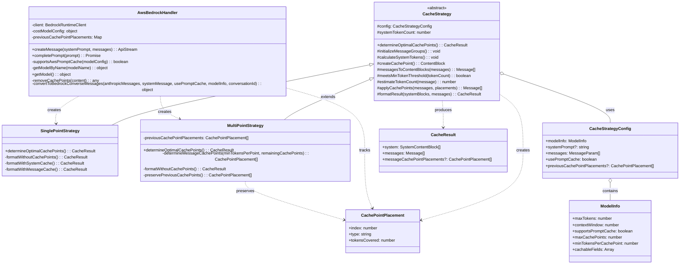
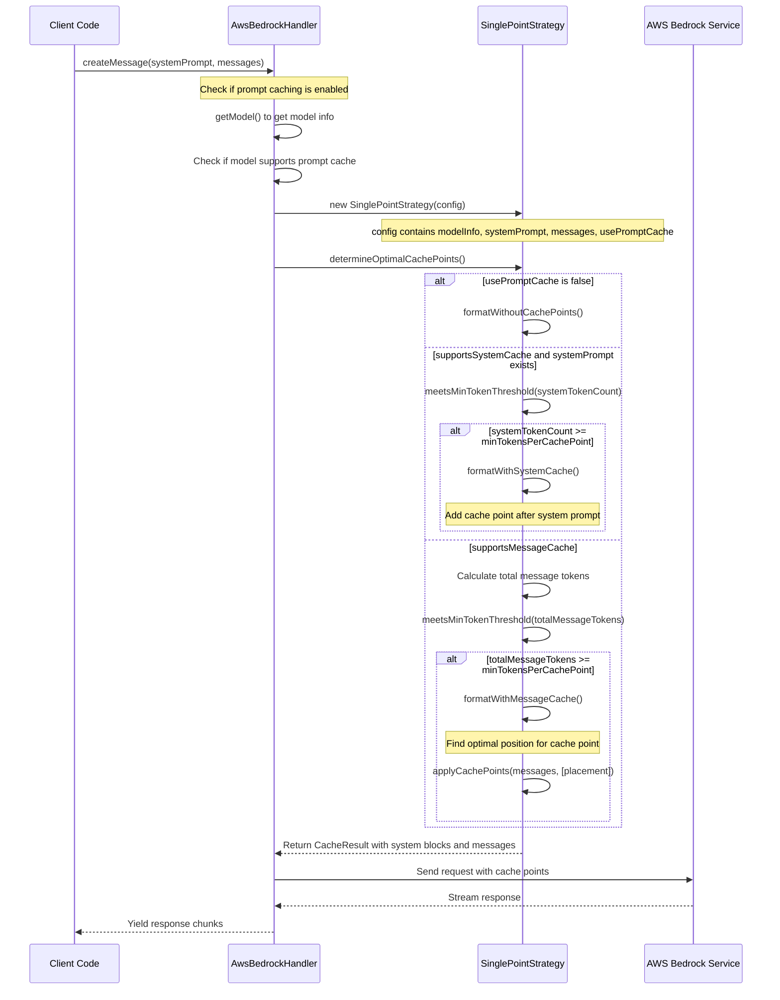
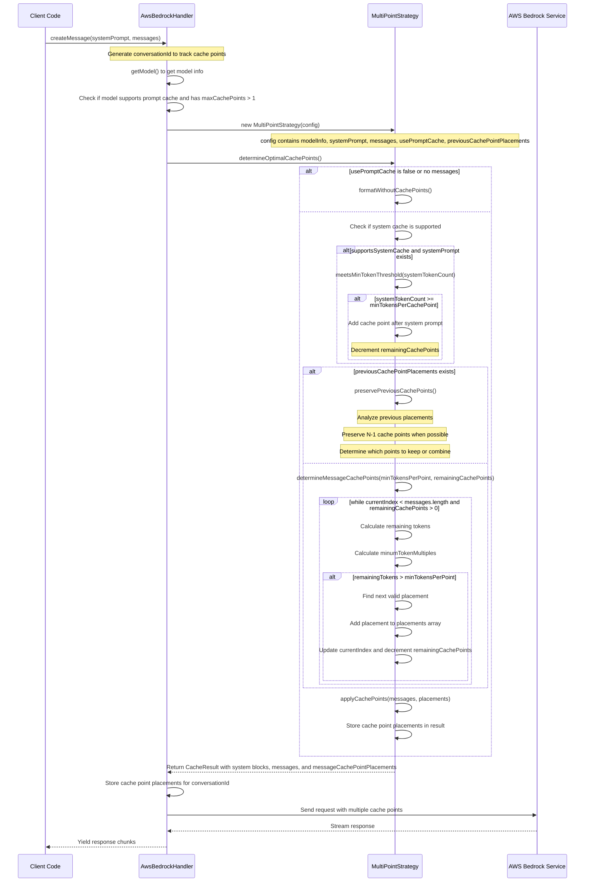

# Cache Strategy Class Relationship and Sequence Diagrams

This document provides class relationship diagrams and sequence diagrams for the cache strategy implementation in the Roo-Code project.

## Class Relationship Diagram

## Sequence Diagram: Single-Point Strategy

This diagram illustrates the process flow when using the SinglePointStrategy for cache point placement.

## Sequence Diagram: Multi-Point Strategy with Cache Point Preservation

This diagram illustrates the process flow when using the MultiPointStrategy with multiple cache points in messages, including the preservation of previous cache points.

## Key Components and Their Relationships

### AwsBedrockHandler

The `AwsBedrockHandler` class is responsible for:

- Creating and managing AWS Bedrock API requests
- Determining which cache strategy to use based on model capabilities
- Tracking cache point placements across consecutive messages using conversation IDs
- Converting Anthropic messages to Bedrock format with appropriate cache points

### CacheStrategy (Abstract Base Class)

The `CacheStrategy` abstract class provides:

- Common functionality for all cache strategies
- Methods for token estimation and threshold checking
- Utilities for message conversion and cache point creation
- Abstract method for determining optimal cache points

### SinglePointStrategy

The `SinglePointStrategy` class:

- Extends CacheStrategy
- Implements a strategy for placing a single cache point
- Places the cache point either after the system prompt or at an optimal position in messages
- Used when the model supports only one cache point

### MultiPointStrategy

The `MultiPointStrategy` class:

- Extends CacheStrategy
- Implements a strategy for placing multiple cache points
- Preserves previous cache points when processing growing conversations
- Analyzes token distribution to determine optimal cache point placements
- Ensures N-1 cache points remain in the same location when possible

### CacheStrategyConfig

The `CacheStrategyConfig` interface:

- Contains configuration for the cache strategy
- Includes model information, messages, and prompt cache settings
- Optionally includes previous cache point placements for maintaining consistency

### CacheResult

The `CacheResult` interface:

- Contains the result of cache strategy application
- Includes system content blocks and message content blocks
- Optionally includes cache point placements for future reference

### CachePointPlacement

The `CachePointPlacement` interface:

- Represents the position and metadata for a cache point
- Includes index, type, and token coverage information
- Used for tracking and preserving cache points across consecutive messages
