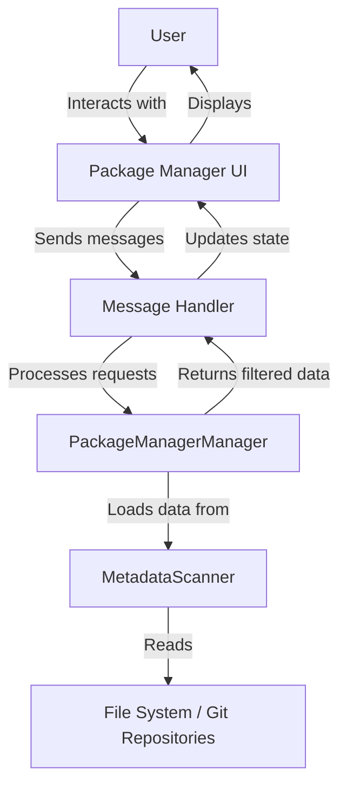
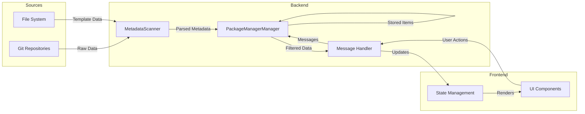
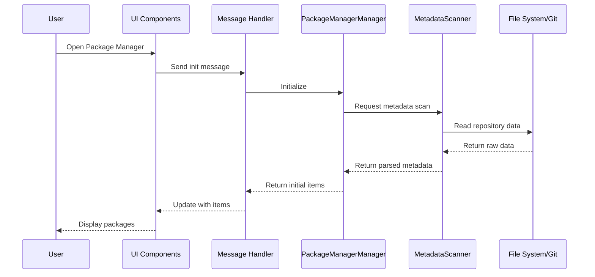
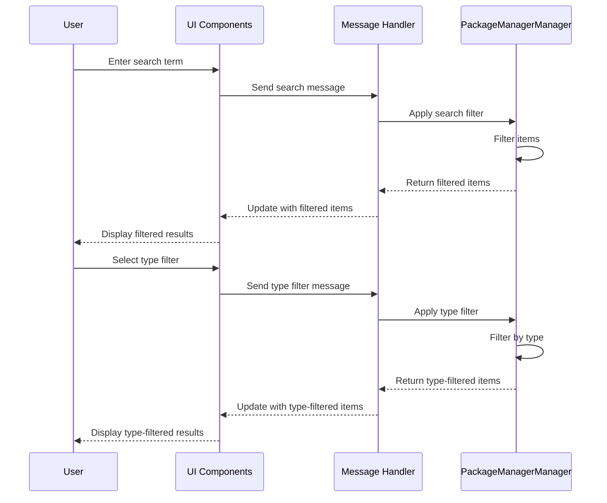
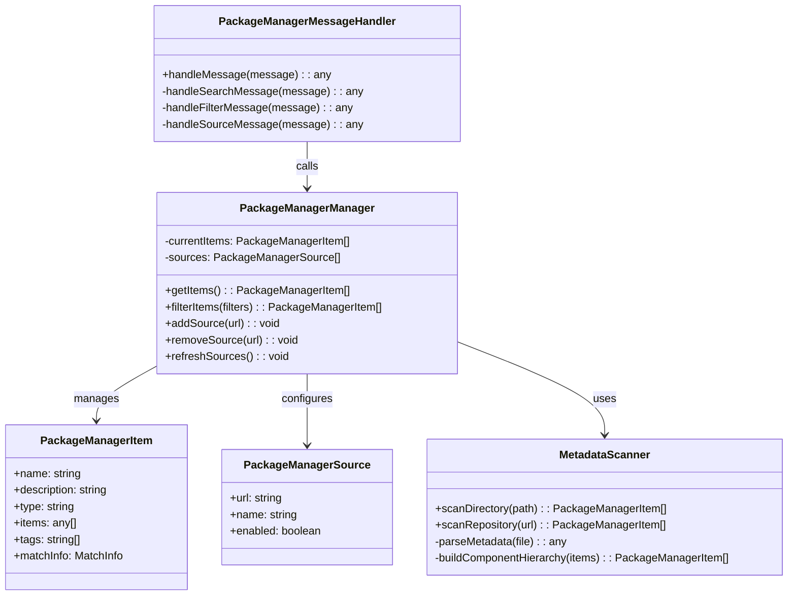
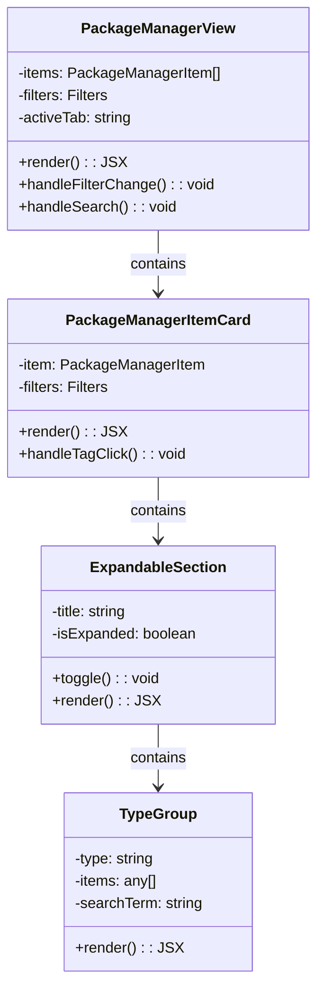

# Package Manager Architecture

This document provides a comprehensive overview of the Package Manager's architecture, including its components, interactions, and data flow.

## System Overview

The Package Manager is built on a modular architecture that separates concerns between data management, UI rendering, and user interactions. The system consists of several key components that work together to provide a seamless experience for discovering, browsing, and managing packages.

### High-Level Architecture



The architecture follows a message-based pattern where:

1. The UI sends messages to the backend through a message handler
2. The backend processes these messages and returns results
3. The UI updates based on the returned data
4. Components are loosely coupled through message passing

## Component Interactions

The Package Manager components interact through a well-defined message flow:

### Core Interaction Patterns

1. **Data Loading**:
   - MetadataScanner loads package data from repositories
   - PackageManagerManager stores and manages this data
   - UI requests data through the message handler

2. **Filtering and Search**:
   - UI sends filter/search criteria to the backend
   - PackageManagerManager applies filters to the data
   - Filtered results are returned to the UI

3. **Source Management**:
   - UI sends source management commands
   - PackageManagerManager updates source configurations
   - MetadataScanner reloads data from updated sources

## Data Flow Diagram

The following diagram illustrates the data flow through the Package Manager system:



## Sequence Diagrams

### Package Loading Sequence

The following sequence diagram shows how packages are loaded from sources:



### Search and Filter Sequence

This sequence diagram illustrates the search and filter process:



## Class Diagrams

### Core Classes

The following class diagram shows the main classes in the Package Manager system:



### UI Component Classes

This class diagram shows the main UI components:



## Component Responsibilities

### Backend Components

1. **MetadataScanner**
   - Scans directories and repositories for package metadata
   - Parses YAML metadata files
   - Builds component hierarchies
   - Handles file system and Git operations

2. **PackageManagerManager**
   - Stores and manages package items
   - Applies filters and search criteria
   - Manages package sources
   - Handles package operations

3. **packageManagerMessageHandler**
   - Routes messages between UI and backend
   - Processes commands from the UI
   - Returns data and status updates to the UI
   - Handles error conditions

### Frontend Components

1. **PackageManagerView**
   - Main container component
   - Manages overall UI state
   - Handles tab navigation
   - Displays filter controls

2. **PackageManagerItemCard**
   - Displays individual package information
   - Handles tag interactions
   - Manages expandable details section
   - Provides action buttons

3. **ExpandableSection**
   - Provides collapsible UI sections
   - Manages expand/collapse state
   - Handles animations
   - Displays section headers and badges

4. **TypeGroup**
   - Groups and displays components by type
   - Formats item lists
   - Highlights search matches
   - Provides consistent styling

## Data Flow Patterns

### Message-Based Communication

The Package Manager uses a message-based architecture for communication between the frontend and backend:

1. **Message Structure**:
   ```typescript
   {
     type: string;     // The message type (e.g., "search", "filter", "addSource")
     payload: any;     // The message data
   }
   ```

2. **Common Message Types**:
   - `search`: Apply a search term filter
   - `filter`: Apply type or tag filters
   - `addSource`: Add a new package source
   - `removeSource`: Remove a package source
   - `refreshSources`: Reload data from sources

3. **Response Structure**:
   ```typescript
   {
     type: string;     // The response type
     data: any;        // The response data
     error?: string;   // Optional error message
   }
   ```

### State Management

The Package Manager maintains state in several places:

1. **Backend State**:
   - Current items in the PackageManagerManager
   - Source configurations
   - Cached metadata

2. **Frontend State**:
   - Current filters and search terms
   - UI state (active tab, expanded sections)
   - Display preferences

3. **Persistent State**:
   - Source configurations stored in extension settings
   - User preferences

## Performance Considerations

The Package Manager architecture addresses several performance challenges:

1. **Lazy Loading**:
   - Metadata is loaded on demand
   - Repositories are scanned only when needed
   - UI components render incrementally

2. **Efficient Filtering**:
   - Filtering happens on the backend to reduce data transfer
   - Search algorithms optimize for common patterns
   - Results are cached when possible

3. **Responsive UI**:
   - Asynchronous operations prevent UI blocking
   - Animations provide feedback during loading
   - Pagination limits the number of items displayed at once

## Error Handling

The architecture includes robust error handling:

1. **Source Errors**:
   - Invalid repositories are marked with error states
   - Users are notified of access issues
   - The system continues to function with other sources

2. **Parsing Errors**:
   - Malformed metadata is gracefully handled
   - Partial results are displayed when possible
   - Error details are logged for debugging

3. **Network Errors**:
   - Timeouts and retries for network operations
   - Offline mode with cached data
   - Clear error messages for user troubleshooting

## Extensibility Points

The Package Manager architecture is designed for extensibility:

1. **New Component Types**:
   - The system can be extended to support new component types
   - Type-specific rendering can be added to the UI
   - Backend processing adapts to new types

2. **Additional Filters**:
   - New filter types can be added to the system
   - Filter logic can be extended in the PackageManagerManager
   - UI can be updated to display new filter controls

3. **Custom Sources**:
   - The source system supports various repository types
   - Custom source providers can be implemented
   - Authentication mechanisms can be extended

---

**Previous**: [Adding Custom Package Sources](../user-guide/06-adding-custom-sources.md) | **Next**: [Core Components](./02-core-components.md)